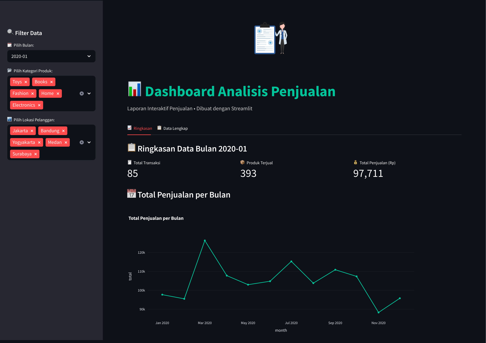
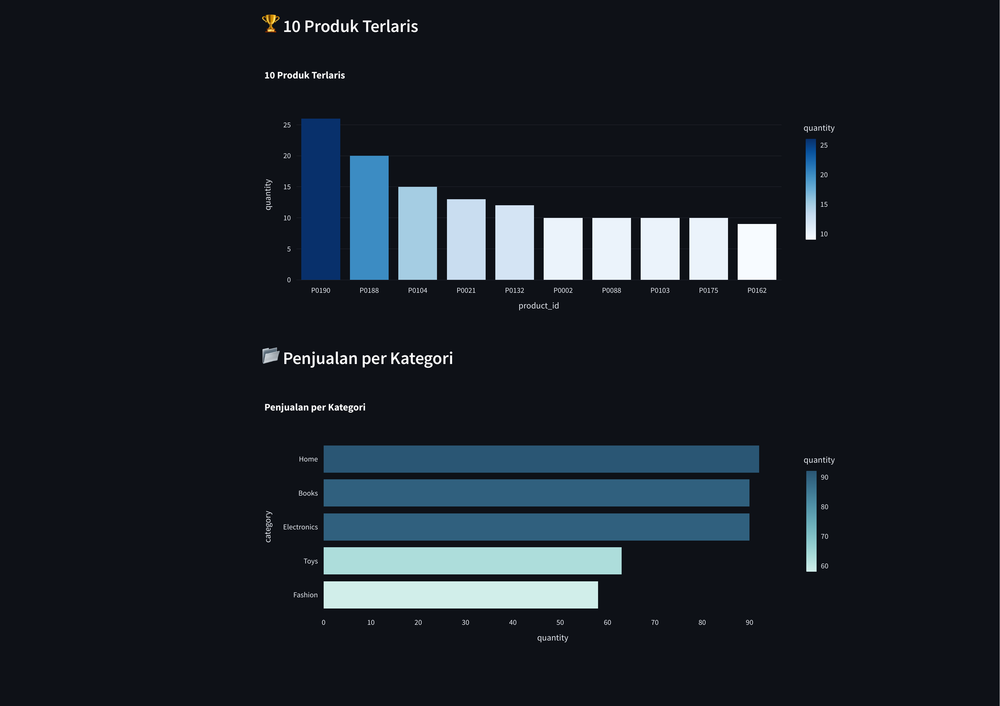
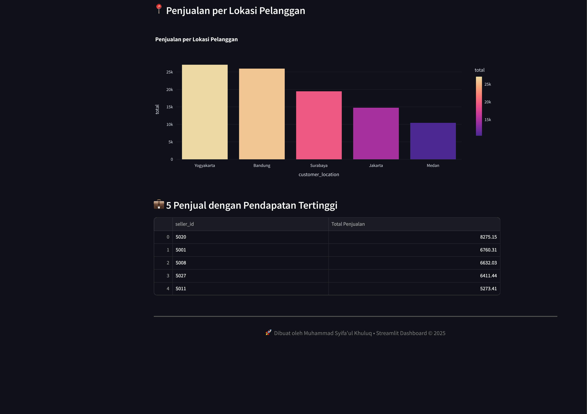
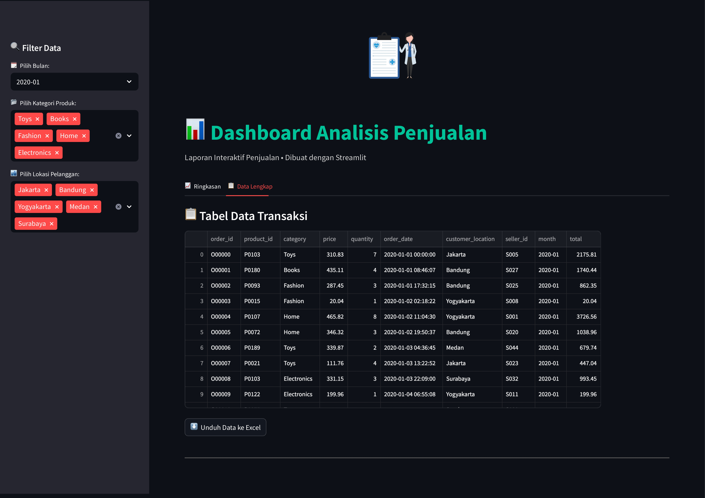

# 📊 Dashboard Analisis Penjualan

Dashboard interaktif untuk menganalisis data penjualan bulanan menggunakan **Streamlit**, **Pandas**, dan **Matplotlib**.

## 🎯 Fitur Utama

- Filter data berdasarkan bulan dan kategori produk
- Filter data berdasarkan lokasi pelanggan
- Visualisasi total penjualan per bulan
- Daftar produk terlaris dan kategori terbanyak
- Total penjuala per-lokasi pelanggan
- Tabel transaksi dan fitur unduh ke Excel
- Tampilan interaktif dan responsif

## 🖼️ Tampilan Dashboard







## 🛠️ Instalasi & Menjalankan

1. Clone repositori ini:
   ```bash
   git clone https://github.com/SyifaulKhuluq/Data_Penjualan.git
   cd Data-Penjualan
   ```

2. Install dependensi:
   ```bash
   pip install -r requirements.txt
   ```

3. Jalankan aplikasi:
   ```bash
   streamlit run dashboard_data_penjualan.py
   ```

## 📂 Struktur Folder

```
.
├── README.md                    # Dokumentasi.
├── Sample_Data_Analisis.csv     # Data penjualan.
├── dashboard_data_penjualan.py  # Script Utama Streamlit.
├── preview_dashboard_1.png      # Screenshot Tampilan Dashboard & Total Penjualan Per-Bulan.
├── preview_dashboard_2.png      # Screenshot Tampilan Produk Terlaris & Penjualan Per-Kategori.
├── preview_dashboard_3.png      # Screenshot Tampilan Lokasi Pelanggan & Seller dengan Penjualan Terbanyak.
├── preview_dashboard_4.png      # Screenshot Tampilan Tabel Data Transaksi < Export to Excel >
└── requirements.txt             # Dependensi
```

## 🙋‍♂️ Pembuat

Dibuat oleh **Muhammad Syifa'ul Khuluq**  
📧 muhammadsyifaulk@gmail.com  
© 2025

---
